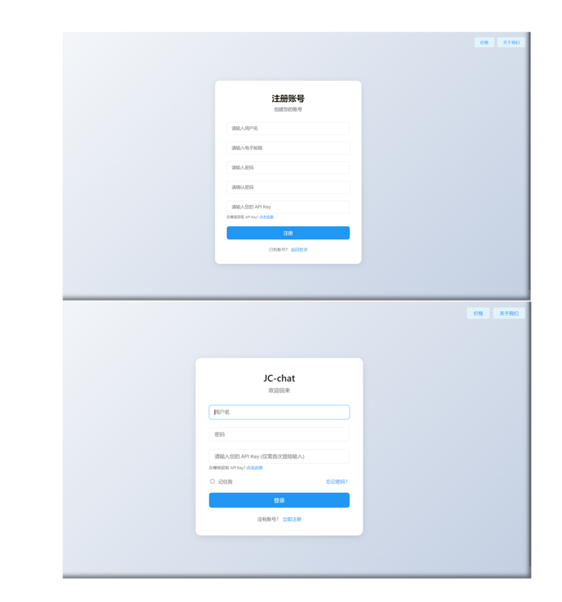

<div align="center">

<a href='#用户版'>
  
</a>

<h1 align="center">JC-Chat</h1>

基于 Openai API 开发的多模型在线智能对话系统，支持代码实时生成运行预览，多场景功能

[JC-Chat](http://121.40.99.140:5000/) / [用户版](#%E7%94%A8%E6%88%B7%E5%AE%9A%E5%88%B6%E7%89%88) / [演示 Demo](http://121.40.99.140:5000/index.html) / [反馈 Issues](https://github.com/Yidadaa/ChatGPT-Next-Web/issues) 

[](http://121.40.99.140:5000/)

</div>

## 用户定制版

满足用户个性化模型定制需求
- **品牌定制**：为用户提供个性化界面和视觉设计，确保平台与用户品牌形象无缝契合，提升品牌一致性。
- **资源集成**：支持用户统一配置和管理多种 AI 资源，团队成员可快速调用，实现高效协作。
- **权限管理**：提供多层级权限控制，包括用户权限、资源权限和知识库权限，确保系统安全性和可控性。
- **知识接入**：支持用户接入内部知识库，结合 AI 能力生成更贴合业务需求的智能回复，提升实用性。
- **安全审计**：自动识别并拦截敏感内容，支持完整对话记录追溯，确保 AI 使用符合用户信息安全规范。
- **私有部署**：支持私有化部署，兼容主流私有云环境，保障用户数据安全和隐私保护。
持续更新：提供多模态、智能体等前沿功能的持续更新服务，确保平台始终保持技术领先，满足用户不断变化的需求。

用户定制版咨询: **2774421277@qq.com**


## 开始使用

1. 准备好你的 [模型 API Key](https://platform.openai.com/account/api-keys);
2. 确保 API Key 具有足够的权限和配额，以支持模型调用和生成任务；
3. 配置环境，安装必要的依赖库，如 openai、flask 等，在项目配置文件中设置 API Key 和环境变量，确保系统能够正确调用模型 API；
4. 将系统部署到生产环境，确保稳定性和安全性；
 


<div align="center">
   


</div>

## 登陆页面
### 账号注册

1. **打开注册页面**：点击“注册”或“创建账号”按钮。填写注册信息
-  **用户名**：输入一个唯一的用户名。
- **邮箱**：输入有效的邮箱地址。
- **密码**：设置一个安全的密码。
- **确认密码**：再次输入密码以确保一致。
- **API Key**：输入您的 API Key（如果没有，点击提示链接获取）。

- 点击“注册”按钮，完成账号创建。
### 账号登录
1. 打开登录页面

2. 点击“登录”按钮并输入登录信息

- **用户名**：输入注册时设置的用户名。
- **密码**：输入注册时设置的密码。
- **API Key（仅首次登录）**：输入您的 API Key。
3. 登录账号：点击“登录”按钮，进入账号。

> **注意**：首次注册登陆账号，需要获得激活资格，请联系管理员。
> 请根据你希望使用的不同模型，进行对应模型的 API key 填写，每次填写会对原来API key 进行覆盖
## 主界面
<div align="center">
   


</div>

### 主界面结构

1. **聊天模型选择**  
   - 目前支持以下模型或版本：  
     - 通义千问  
     - GPT 4o  
     - GPT 4o mini  
     - Openai o1  
     - DeepSeek-V3 模型  

2. **功能按钮**  
   - **工具箱**：提供辅助功能（如翻译、计算等）。  
   - **日夜模式**：用于切换主页面风格模式。  
   - **返回**：返回上一页登陆页面。  
   - **新对话**：开启新的聊天会话。

3. **左边聊天栏**  
   - 显示历史聊天记录或会话列表，支持快速切换或查看之前的对话。

4. **聊天区域**  
   - 显示当前聊天内容。

5. **输入区域**  
   - **输入框**：提示“请输入内容...”，用于用户输入问题或指令。  
   - **发送按钮**：点击后发送输入内容。


### 聊天页面功能

#### 1. **消息显示功能**
   - **时间戳显示**：每条消息在气泡右下角显示时间戳，格式为本地时间，帮助用户清晰了解对话的时间节点。
   - **Markdown 渲染**：AI 回复内容支持 Markdown 渲染，包括代码块、列表、标题等，提升阅读体验。

#### 2. **代码处理功能**
<div align="center">
   


</div>

   - **代码高亮显示**：使用 Highlight.js 自动识别编程语言并添加语法高亮，使代码更易读。
   - **代码复制功能**：在代码块右上角显示复制按钮，用户点击后可将代码直接复制到剪贴板。
   - **代码编辑功能**：支持用户直接修改生成的代码片段，并通过“运行”按钮提交编辑后的代码。
   - **实时代码运行**：
     - **Python 代码执行**：后端提供安全沙箱环境，运行用户提交的 Python 代码，并返回标准输出或错误信息。
     - **JavaScript 代码执行**：在前端通过 iframe 执行简单的 JavaScript 脚本，返回结果并显示。
     - **HTML 代码预览**：支持将生成的 HTML 片段直接渲染在预览窗口中，展示网页效果。
   - **运行结果展示**：
     - **文本输出**：如打印的调试信息或返回值，清晰展示在消息气泡中。
     - **图形输出**：支持如 Matplotlib 图表的图片嵌入，直接展示可视化结果。
     - **错误提示**：当代码执行出错时，详细的错误信息会以红色高亮显示，便于用户排查问题。
<div align="center">
   


</div>

#### 3. **文件处理功能**
   - **文件上传**：
     - **支持 DOCX 文件**：用户可以上传 Word 文档，系统通过 Python 的 `python-docx` 库提取文本内容并插入对话区域。
     - **支持 PDF 文件**：上传 PDF 后，后端使用 `PyPDF2` 解析其文本内容，自动提取并展示。
     - **支持图片文件**：用户可以上传图片文件（如 JPG、PNG 等），系统支持以下功能：
       - **图片预览**：上传的图片会在聊天区域直接显示，便于用户查看。
       - **图像分析**：大模型支持识别图片中的物体、场景、人物等信息，并生成描述性文本。
       - **图表数据提取**：识别图片中的图表（如柱状图、饼图等），并提取相关数据。
       - **图片标注**：用户可以在图片上添加标注或注释，标注内容会同步显示在聊天记录中。
     - **文件内容提取**：无论上传 DOCX、PDF 还是图片，系统均会按段落拆分并显示，用户可手动调整输入。
     - **错误处理**：当用户上传的文件格式不支持或文件过大时，系统会立即提示，并阻止提交。
   - **文件导出**：
     - **图片下载功能**：用户可以将对话记录中的文本内容截图保存为 PNG 文件，方便离线查看。
     - **HTML 预览导出**：支持将对话以静态 HTML 页面导出，供用户在浏览器中查看完整记录。
     - **Python 图表导出**：对话中生成的图表可以单独以 PNG 或 SVG 格式下载，便于使用。
     - **图片导出**：用户可以将上传或生成的图片单独导出为 JPG 或 PNG 格式。

#### 4. **图片交互功能**
   - **用户发送图片**：用户可以通过上传图片的方式发送图片消息，图片会显示在聊天区域。
   - **大模型识别图片**：大模型支持对用户发送的图片进行识别和分析，包括：
     - **图像分析**：识别图片中的物体、场景、人物等信息，并生成描述性文本。
     - **图表数据提取**：识别图片中的图表数据，并生成相关分析结果。
   - **图片回复**：大模型可以基于图片内容生成回复，回复内容可能包括文字描述、数据分析结果或建议。
#### 5. 论文翻译功能
<div align="center">
   


</div>

基于 [PDFMathTranslate](https://github.com/Byaidu/PDFMathTranslate)，支持将学术论文（PDF 格式）翻译为目标语言，保留公式、图表和排版。

#### 功能特点

- **多语言支持**：支持中、英、日、德等语言互译，满足多语言学术需求。
- **分段翻译**：将论文按段落拆分，逐段翻译并显示结果，支持手动编辑和重新翻译。
- **公式与图表保留**：自动识别并保留 PDF 中的数学公式、图表和特殊符号，确保翻译结果准确。
- **导出格式**：支持导出为 PDF、DOCX、Markdown 格式，方便用户进一步使用和分享。

#### 使用步骤

1. **上传论文**：点击“上传 PDF”按钮，选择需要翻译的学术论文文件。
2. **选择语言**：在语言选择下拉菜单中，选择目标翻译语言（如中文、英语等）。
3. **开始翻译**：点击“开始翻译”按钮，系统会逐段翻译论文内容。
4. **查看与编辑**：翻译完成后，用户可查看原文与译文对照，手动编辑或重新翻译特定段落。
5. **导出结果**：点击“导出”按钮，选择导出格式（PDF、DOCX 或 Markdown），系统会生成并下载翻译后的文件。
   
## 本地运行指南

1. **安装依赖**
   ```
   pip install -r requirements.txt
   ```
2. **配置环境变量: 在项目根目录下创建 .env 文件，并添加以下内容：**
   ```
   OPENAI_API_KEY=your_openai_api_key
   SECRET_KEY=your_secret_key
   ```
3. **启动服务器**
   ```
   python app.py
   ```
4. 访问应用: 打开浏览器，访问 http://localhost:5000。

## 🛠️ 技术栈

### 前端
- HTML5 + CSS3
- JavaScript
- Markdown 渲染
- 代码高亮
- 响应式设计

### 后端
- Python 3.9+
- Flask 框架
- OpenAI API
- Docker

## 📞 联系方式

- 作者：chuan
- Email：[2774421277@qq.com]
- GitHub：[@chuanchuan123321](https://github.com/chuanchuan123321)
